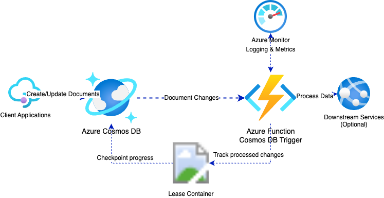

<!--
---
name: Azure Functions TypeScript CosmosDb Trigger using Azure Developer CLI
description: This repository contains an Azure Functions CosmosDb trigger quickstart written in TypeScript and deployed to Azure Functions Flex Consumption using the Azure Developer CLI (azd). The sample uses managed identity and a virtual network to make sure deployment is secure by default.
page_type: sample
products:
- azure-functions
- azure-cosmos-db
- azure
- entra-id
urlFragment: starter-cosmosdb-trigger-typescript
languages:
- typescript
- bicep
- azdeveloper
---
-->

# Azure Functions with Cosmos DB Trigger (TypeScript)

An Azure Functions QuickStart project that demonstrates how to use a Cosmos DB Trigger with Azure Developer CLI (azd) for quick and easy deployment, using TypeScript and Node.js 20 or higher.

## Architecture



This architecture shows how the Azure Function is triggered automatically when documents are created or modified in Cosmos DB through the change feed mechanism. The key components include:

- **Client Applications**: Create or update documents in Cosmos DB
- **Azure Cosmos DB**: Stores documents and provides change feed capabilities
- **Change Feed**: Detects modifications to documents in Cosmos DB
- **Azure Function with Cosmos DB Trigger**: Executes automatically when changes are detected
- **Lease Container**: Tracks which changes have been processed to ensure reliability and support for multiple function instances
- **Azure Monitor**: Provides logging and metrics for the function execution
- **Downstream Services**: Optional integration with other services that receive processed data

This serverless architecture enables highly scalable, event-driven processing with built-in resiliency.

## Top Use Cases

1. **Real-time Data Processing Pipeline**: Automatically process data as it's created or modified in your Cosmos DB. Perfect for scenarios where you need to enrich documents, update analytics, or trigger notifications when new data arrives without polling.
2. **Event-Driven Microservices**: Build event-driven architectures where changes to your Cosmos DB documents automatically trigger downstream business logic. Ideal for order processing systems, inventory management, or content moderation workflows.

## Features

* Cosmos DB Trigger
* Azure Functions Flex Consumption plan
* Azure Developer CLI (azd) integration for easy deployment
* Infrastructure as Code using Bicep templates
* TypeScript (Node.js 20+) support

## Getting Started

### Prerequisites

- [Node.js 20+](https://nodejs.org/en/about/releases/)
- [Azure Functions Core Tools](https://docs.microsoft.com/azure/azure-functions/functions-run-local#install-the-azure-functions-core-tools)
- [Azure Developer CLI (azd)](https://docs.microsoft.com/azure/developer/azure-developer-cli/install-azd)
- [Azurite](https://github.com/Azure/Azurite)
- An Azure subscription

### Quickstart

1. Clone this repository
   ```bash
   git clone https://github.com/Azure-Samples/functions-quickstart-typescript-azd-cosmosdb.git
   cd functions-quickstart-typescript-azd-cosmosdb
   ```

2. Make scripts executable (Mac/Linux):
   ```bash
   chmod +x ./infra/scripts/*.sh
   ```
   On Windows:
   ```powershell
   set-executionpolicy remotesigned
   ```

3. Provision Azure resources using azd
   ```bash
   azd provision
   ```
   This will create all necessary Azure resources including:
   - Azure Cosmos DB account
   - Azure Function App
   - App Service Plan
   - Other supporting resources
   - `local.settings.json` for local development with Azure Functions Core Tools, which should look like this:
   ```json
   {
     "IsEncrypted": false,
     "Values": {
       "AzureWebJobsStorage": "UseDevelopmentStorage=true",
       "FUNCTIONS_WORKER_RUNTIME": "node",
       "COSMOS_CONNECTION": "<your-cosmos-connection-string>",
       "COSMOS_DATABASE_NAME": "documents-db",
       "COSMOS_CONTAINER_NAME": "documents"
     }
   }
   ```

   The `azd` command automatically sets up the required connection strings and application settings.

4. (Optional) Install dependencies:
   ```bash
   npm install
   ```

5. Build the TypeScript project:
   ```bash
   npm run build
   ```

6. Start the function locally
   ```bash
   func start
   ```
   Or use VS Code to run the project with the built-in Azure Functions extension by pressing F5.

7. Test the function locally by creating a document in your Cosmos DB container

   You can use Azure Portal or Azure CLI to create a document like this:
   ```json
   {
     "id": "doc-001",
     "Text": "This is a sample document",
     "Number": 42,
     "Boolean": true
   }
   ```

   When the document is created or modified, the function will trigger automatically. You should see console output like:
   ```
   Cosmos DB function processed 1 documents
   First document: { ... }
   First document id: doc-001
   ```

8. Deploy to Azure
   ```bash
   azd up
   ```
   This will build your function app and deploy it to Azure. The deployment process:
   - Checks for any bicep changes using `azd provision`
   - Packages the TypeScript project
   - Publishes the function app using `azd deploy`
   - Updates application settings in Azure

   > **Note:** If you deploy with `vnetEnabled=true`, see the [Networking and VNet Integration](#networking-and-vnet-integration) section below for important details about accessing Cosmos DB and Data Explorer from your developer machine.

9. Test the deployed function by adding another document to your Cosmos DB container through the Azure Portal:
   - Navigate to your Cosmos DB account in the Azure Portal
   - Go to Data Explorer
   - Find your database and container
   - Create a new document with similar structure to the test document above
   - Check your function logs in the Azure Portal to verify the trigger worked

## Understanding the Function

This function is triggered by changes in Cosmos DB documents using the change feed. The key environment variables that configure its behavior are:

- `COSMOS_CONNECTION__accountEndpoint`: The Cosmos DB account endpoint
- `COSMOS_DATABASE_NAME`: The name of the database to monitor
- `COSMOS_CONTAINER_NAME`: The name of the container to monitor

These are automatically set up by azd during deployment for both local and cloud environments.

### Core TypeScript Implementation

Here is the core implementation of the Cosmos DB trigger function in this repo:

```typescript
import { app, InvocationContext } from "@azure/functions";

export async function cosmos_trigger(documents: unknown[], context: InvocationContext): Promise<void> {
    context.log(`Cosmos DB function processed ${documents.length} documents`);

    if (documents && documents.length > 0) {
        for (const doc of documents) {
            context.log(`First document: ${JSON.stringify(doc)}`);
            if (doc && typeof doc === "object" && "id" in doc) {
                context.log(`First document id: ${(doc as { id?: string }).id}`);
            }
        }
    } else {
        context.log("No documents found.");
    }
}

app.cosmosDB('cosmos_trigger', {
    connectionStringSetting: 'COSMOS_CONNECTION',
    databaseName: 'documents-db',
    collectionName: 'documents',
    createLeaseCollectionIfNotExists: true,
    handler: cosmos_trigger
});
```

The function uses a lease container to track processed changes and support multiple instances. When documents are added or modified in the monitored container, the change feed automatically triggers this function.

## Monitoring and Logs

You can monitor your function in the Azure Portal:
1. Navigate to your function app in the Azure Portal
2. Select "Functions" from the left menu
3. Click on your function (cosmos_trigger)
4. Select "Monitor" to view execution logs

Use the "Live Metrics" feature to see real-time information when testing.

## Networking and VNet Integration

If you deploy with `vnetEnabled=true`, all access to Cosmos DB is restricted to the private endpoint and the connected virtual network. This enhances security by blocking public access to your database.

**Important:** When `vnetEnabled=true`, it is a requirement to add your developer machine's public IP address to the Cosmos DB account's networking firewall allow list. *The deployment scripts included in this template run as a part of `azd provision` and handle this for you*. Alternatively it can be done in the Azure Portal or Azure CLI.

## Resources

- [Azure Functions Documentation](https://docs.microsoft.com/azure/azure-functions/)
- [Cosmos DB Documentation](https://docs.microsoft.com/azure/cosmos-db/)
- [Azure Developer CLI Documentation](https://docs.microsoft.com/azure/developer/azure-developer-cli/)
