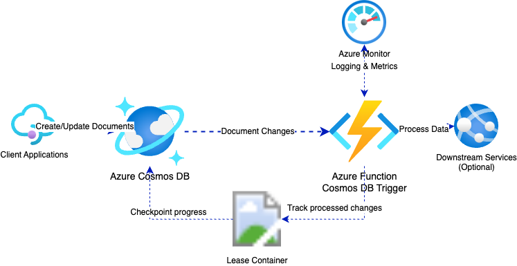

<!--
---
name: Azure Functions TypeScript CosmosDb Trigger using Azure Developer CLI
description: This repository contains an Azure Functions CosmosDb trigger quickstart written in TypeScript and deployed to Azure Functions Flex Consumption using the Azure Developer CLI (azd). The sample uses managed identity and a virtual network to make sure deployment is secure by default.
page_type: sample
products:
- azure-functions
- azure-cosmos-db
- azure
- entra-id
urlFragment: starter-cosmosdb-trigger-typescript
languages:
- typescript
- bicep
- azdeveloper
---
-->

# Azure Functions with Cosmos DB Trigger (TypeScript)

An Azure Functions QuickStart project that runs three triggers over the same Cosmos DB container. The existing `cosmos_trigger` remains unchanged, `cosmos_latest_version_trigger` demonstrates `CosmosDBv4ChangeFeedMode.LatestVersion`, and `cosmos_all_versions_and_deletes_trigger` demonstrates `CosmosDBv4ChangeFeedMode.AllVersionsAndDeletes`.

> **Looking for another language?** This quickstart is also available in
> [C# (.NET)](https://github.com/Azure-Samples/functions-quickstart-dotnet-azd-cosmosdb) |
> [Java](https://github.com/Azure-Samples/functions-quickstart-java-azd-cosmosdb) |
> [JavaScript](https://github.com/Azure-Samples/functions-quickstart-javascript-azd-cosmosdb) |
> [Python](https://github.com/Azure-Samples/functions-quickstart-python-azd-cosmosdb) |
> [PowerShell](https://github.com/Azure-Samples/functions-quickstart-powershell-azd-cosmosdb)

## Architecture



This diagram shows the shared single-trigger architecture used by each function in the sample. The key components include:

- **Client Applications**: Create, replace, or delete documents in Cosmos DB
- **Azure Cosmos DB**: Stores documents and provides change feed capabilities
- **Change Feed**: Captures every create, replace, and delete operation in order
- **Azure Function with Cosmos DB Trigger**: Executes automatically when changes are detected
- **Lease Container**: Tracks which changes have been processed to ensure reliability and support for multiple function instances
- **Azure Monitor**: Provides logging and metrics for the function execution
- **Downstream Services**: Optional integration with other services that receive processed data

The code registers the unchanged default trigger and separate LatestVersion and AllVersionsAndDeletes examples over the same source container.

This serverless architecture enables highly scalable, event-driven processing with built-in resiliency.

## Top Use Cases

1. **Real-time Data Processing Pipeline**: Automatically process data as it's created or modified in your Cosmos DB. Perfect for scenarios where you need to enrich documents, update analytics, or trigger notifications when new data arrives without polling.
2. **Event-Driven Microservices**: Build event-driven architectures where changes to your Cosmos DB documents automatically trigger downstream business logic. Ideal for order processing systems, inventory management, or content moderation workflows.

## Features

- Existing Cosmos DB latest-version trigger
- Separate trigger with `CosmosDBv4ChangeFeedMode.LatestVersion`
- Cosmos DB Trigger with `CosmosDBv4ChangeFeedMode.AllVersionsAndDeletes`
- Independent lease prefixes so the explicit mode samples process the same writes
- Typed create, replace, delete, and TTL-delete metadata
- Continuous backup with seven-day change retention
- Azure Functions Flex Consumption plan
- Azure Developer CLI (azd) integration for easy deployment
- Infrastructure as Code using Bicep templates
- TypeScript on Node.js 24

## Getting Started

### Prerequisites

- [A supported Node.js version](https://learn.microsoft.com/azure/azure-functions/supported-languages?pivots=programming-language-javascript#languages-by-runtime-version)
- [Azure Functions Core Tools](https://docs.microsoft.com/azure/azure-functions/functions-run-local#install-the-azure-functions-core-tools)
- [Azure Developer CLI (azd)](https://docs.microsoft.com/azure/developer/azure-developer-cli/install-azd)
- [Azure CLI](https://learn.microsoft.com/cli/azure/install-azure-cli) authenticated with `az login`
- [Azurite](https://github.com/Azure/Azurite)
- An Azure subscription

> [!IMPORTANT]
> The Cosmos DB Emulator doesn't support All Versions and Deletes mode. The function runs locally, but it must connect to the Azure Cosmos DB for NoSQL account provisioned by this sample. Azurite is used only for the Functions host storage setting.

### Quickstart

1. Clone this repository

   ```bash
   git clone https://github.com/Azure-Samples/functions-quickstart-typescript-azd-cosmosdb.git
   cd functions-quickstart-typescript-azd-cosmosdb
   ```

2. Make scripts executable (Mac/Linux):

   ```bash
   chmod +x ./infra/scripts/*.sh
   ```

   On Windows:

   ```powershell
   set-executionpolicy remotesigned
   ```

3. Provision Azure resources using azd

   ```bash
   azd provision
   ```

   This will create all necessary Azure resources including:

   - Azure Cosmos DB for NoSQL account with continuous seven-day backup
   - Azure Function App
   - App Service Plan
   - Other supporting resources
   - The All Versions and Deletes account feature, enabled by the post-provision hook
   - `local.settings.json` for local development with Azure Functions Core Tools, which should look like this:

   ```json
   {
     "IsEncrypted": false,
     "Values": {
       "AzureWebJobsStorage": "UseDevelopmentStorage=true",
       "FUNCTIONS_WORKER_RUNTIME": "node",
       "COSMOS_CONNECTION__accountEndpoint": "https://<account-name>.documents.azure.com:443/",
       "COSMOS_DATABASE_NAME": "documents-db",
       "COSMOS_CONTAINER_NAME": "documents"
     }
   }
   ```

   The `azd` command automatically sets up the required identity-based connection and application settings. Enabling All Versions and Deletes can take up to 30 minutes.

   To run locally against an existing Cosmos DB account instead, copy the settings template and replace its placeholder values. The signed-in identity must have a Cosmos DB data-plane role on the account.

   ```bash
   cp local.settings.json.template local.settings.json
   ```

   On Windows:

   ```powershell
   Copy-Item local.settings.json.template local.settings.json
   ```

4. Install dependencies:

   ```bash
   npm install
   ```

5. Build the TypeScript project:

   ```bash
   npm run build
   ```

   Run the zero-cloud handler test:

   ```bash
   npm test
   ```

6. Start Azurite, then start the functions locally in a separate terminal. Start the functions before changing any documents because AllVersionsAndDeletes mode starts from the current time.

   ```bash
   azurite --silent
   ```

   ```bash
   npm start
   ```

   Or use VS Code to run the project with the built-in Azure Functions extension by pressing F5.

7. In the Azure portal, open the provisioned Cosmos DB account, select **Data Explorer**, and create this item in the `documents-db` database and `documents` container:

   ```json
   {
     "id": "change-feed-test",
     "status": "created",
     "sequence": 1
   }
   ```

   On create, all three triggers run. The original and explicit LatestVersion triggers log the document, while the AllVersionsAndDeletes trigger also logs the operation type:

   ```text
   Cosmos DB function processed 1 documents
   First document id: change-feed-test
   Cosmos DB LatestVersion function processed 1 documents
   LatestVersion document id: change-feed-test
   Operation: create; document id: change-feed-test
   ```

   Replace `status` with `"updated"` and `sequence` with `2`, then save it again. All three triggers run:

   ```text
   Cosmos DB function processed 1 documents
   First document id: change-feed-test
   Cosmos DB LatestVersion function processed 1 documents
   LatestVersion document id: change-feed-test
   Operation: replace; document id: change-feed-test
   ```

   Delete the item. Only the AllVersionsAndDeletes trigger receives the delete:

   ```text
   Operation: delete; document id: change-feed-test
   ```

   Wait for all expected invocations before performing the next operation. Their order in the terminal can vary. A delete event can contain an empty `current` object, so the AllVersionsAndDeletes handler treats it as absent and reads its ID from `metadata`.

8. Deploy to Azure

   ```bash
   azd up
   ```

   This will build your function app and deploy it to Azure. The deployment process:

   - Checks for any bicep changes using `azd provision`
   - Packages the TypeScript project
   - Publishes the function app using `azd deploy`
   - Updates application settings in Azure

   > **Note:** If you deploy with `vnetEnabled=true`, see the [Networking and VNet Integration](#networking-and-vnet-integration) section below for important details about accessing Cosmos DB and Data Explorer from your developer machine.

9. Test the deployed function by adding another document to your Cosmos DB container through the Azure Portal:
   - Navigate to your Cosmos DB account in the Azure Portal
   - Go to Data Explorer
   - Find your database and container
   - Create a new document with similar structure to the test document above
   - Check your function logs in the Azure Portal to verify the trigger worked

## Understanding the Function

The original `cosmos_trigger` remains unchanged and uses the sample's `documents-db` database and `documents` container. The two explicit mode samples use these environment variables:

- `COSMOS_CONNECTION__accountEndpoint`: The Cosmos DB account endpoint
- `COSMOS_DATABASE_NAME`: The name of the database to monitor
- `COSMOS_CONTAINER_NAME`: The name of the container to monitor

These are automatically set up by azd during deployment for both local and cloud environments.

### Core TypeScript Implementations

- [`src/functions/cosmos_trigger.ts`](src/functions/cosmos_trigger.ts) contains the existing latest-version handler. It receives plain documents for creates and replaces.
- [`src/functions/cosmos_latest_version_trigger.ts`](src/functions/cosmos_latest_version_trigger.ts) contains the explicit LatestVersion enum sample. It receives plain documents for creates and replaces.
- [`src/functions/cosmos_all_versions_and_deletes_trigger.ts`](src/functions/cosmos_all_versions_and_deletes_trigger.ts) contains the AllVersionsAndDeletes handler. It receives `CosmosDBChangeFeedItem<T>` envelopes with operation metadata and delete events and registers with `CosmosDBv4ChangeFeedMode.AllVersionsAndDeletes`.

The explicit mode samples use the pre-provisioned `leases` container with different `leaseContainerPrefix` values, allowing them to process the same source container independently while leaving the original trigger registration untouched. AllVersionsAndDeletes mode can start from now or from an existing lease checkpoint; it doesn't support `startFromBeginning` or `startFromTime`.

## Monitoring and Logs

You can monitor your function in the Azure Portal:

1. Navigate to your function app in the Azure Portal
2. Select "Functions" from the left menu
3. Click on `cosmos_trigger`, `cosmos_latest_version_trigger`, or `cosmos_all_versions_and_deletes_trigger`
4. Select "Monitor" to view execution logs

Use the "Live Metrics" feature to see real-time information when testing.

## Networking and VNet Integration

If you deploy with `vnetEnabled=true`, all access to Cosmos DB is restricted to the private endpoint and the connected virtual network. This enhances security by blocking public access to your database.

**Important:** When `vnetEnabled=true`, it is a requirement to add your developer machine's public IP address to the Cosmos DB account's networking firewall allow list. *The deployment scripts included in this template run as a part of `azd provision` and handle this for you*. Alternatively it can be done in the Azure Portal or Azure CLI.

## Resources

- [Azure Functions Documentation](https://docs.microsoft.com/azure/azure-functions/)
- [Cosmos DB Documentation](https://docs.microsoft.com/azure/cosmos-db/)
- [Cosmos DB Change Feed Modes](https://learn.microsoft.com/azure/cosmos-db/nosql/change-feed-modes)
- [Azure Developer CLI Documentation](https://docs.microsoft.com/azure/developer/azure-developer-cli/)
